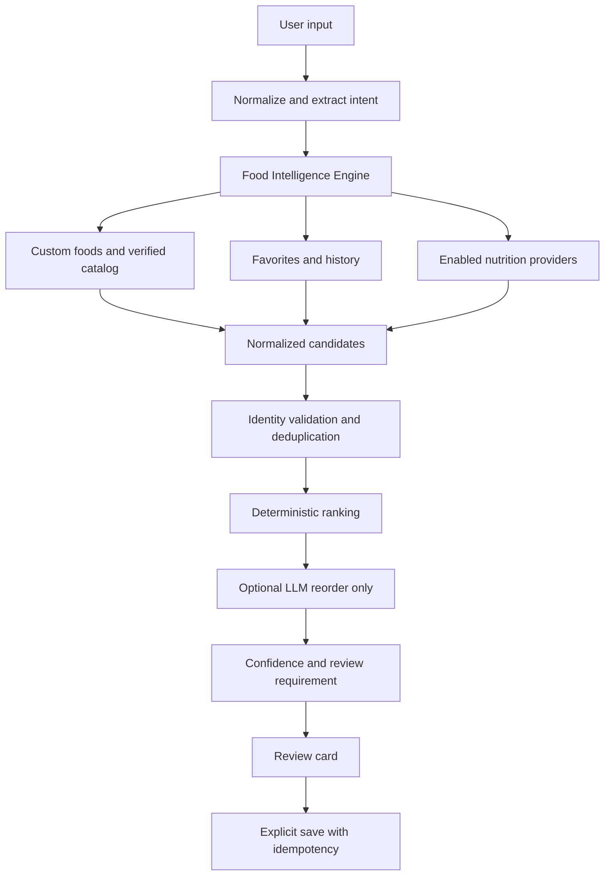

# Food Intelligence Architecture

MacroMesh has one server-side discovery contract for chat, search, barcode, favorites, history, suggestions, and future voice input.

## Ownership

- OpenAI extracts intent, components, aliases, and modifiers. It does not author trusted nutrition.
- Providers own nutrition records and serving metadata.
- `lib/food-intelligence/engine.ts` owns entry-point parity and normalized results.
- `lib/food-search.ts` owns candidate collection, deduplication, deterministic ranking, and review metadata.
- Pending meal state owns review and save-once behavior.

## Invariants

- Raw provider payloads never reach iOS.
- Provider nutrition and serving fields stay atomic; records are never blended.
- LLM ranking cannot alter nutrition, source, confidence, or candidate IDs.
- Provider failure is isolated and cannot block healthy providers.
- AI estimates are last-resort, labeled estimates, and always reviewable.
- Favorites, recents, and suggestions are refreshed into review state and never auto-saved.
