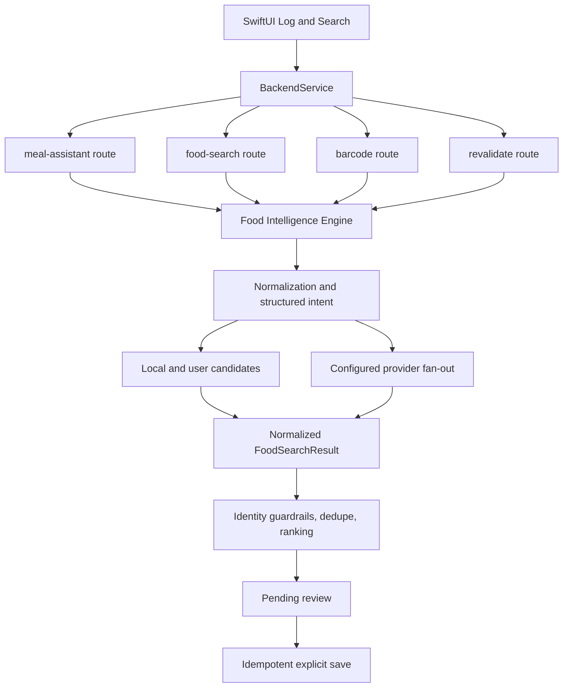

# Current Architecture

## Runtime flow

## Entry points

| Surface | Native entry | Backend entry | Engine path |
|---|---|---|---|
| AI chat and meal editing | `LogChatView` | `/api/meal-assistant` | `resolveFoodIntelligenceItem` during nutrition hydration |
| Typed search and suggestions | `FoodSearchSheet` in `LogChatView` | `/api/food-search` | `searchFoodIntelligence` |
| Barcode | Barcode scanner in `LogChatView` | `/api/barcode-lookup` | `lookupBarcodeFoodIntelligence` |
| Favorites and recent foods | Quick meal rails | `/api/food-intelligence/revalidate` | `revalidateFoodIntelligenceItems` |
| History relog | History repeat action | revalidation route | `revalidateFoodIntelligenceItems` |
| Voice origin | Engine contract only | shared search contract | `origin: voice`; no separate nutrition resolver |
| Legacy web meal logger | `components/meal-logger-client.tsx` | `/api/ai/parse-meal` | `resolveNutritionEstimate` enters the shared engine first; multi-item fallback uses legacy decomposition and provider hydration |

All paths produce normalized items for review. `/api/meals` owns the final save and database idempotency. The client also disables repeated save actions while a save is active.

## Legacy and limitations

- The meal assistant still has deterministic conversation and fallback helpers around the shared nutrition engine. These are state-machine behavior, not a second trusted nutrition database.
- The legacy web parse route has not been removed. Its first database path uses the shared engine, but fallback multi-item hydration still calls the shared provider adapters through `lookupNutrition` sequentially. This is the remaining orchestration migration boundary.
- User learning currently uses confirmed favorites, recents, serving history, and source preference. A versioned correction-event table is not implemented.
- Provider caches are in-process. They are versioned and coalesce in-flight calls but are not a distributed cache.
- Per-provider timeouts and bounded retries exist. There is no persistent circuit-breaker service.
- Release TestFlight builds point at the production Vercel URL. Pull-request previews require direct smoke testing or a separately configured QA binary.
