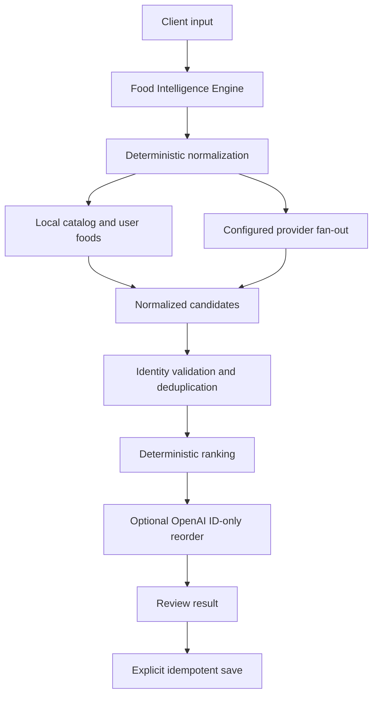

# Food Search Architecture

MacroMesh has one server-side discovery engine. AI chat, typed food search, barcode lookup, favorites, history, reusable meals, and suggestions enter through `lib/food-intelligence/engine.ts` and receive normalized `FoodSearchResult` records.

## Entry points

- Food Search: `GET /api/food-search?q=...` calls `searchFoodIntelligence`.
- AI Chat: item hydration calls `resolveFoodIntelligenceItem` through the same engine.
- Barcode: `lookupBarcodeFoodIntelligence` returns the same review model.
- Favorites and history: `revalidateFoodIntelligenceItems` refreshes saved identity into review state.

The iOS app calls only MacroMesh routes. Raw provider payloads and provider credentials never reach the client.

## Release behavior

The native Release build currently sets `CALORIE_COMPASS_BASE_URL` to `https://calorie-compass-chi.vercel.app`. A TestFlight build therefore exercises the production deployment, not a pull-request preview. Preview smoke tests should call the preview URL directly. TestFlight behavior changes only after the intended backend commit is deployed to production, or a separately configured QA build is compiled against a preview URL.

## Trust invariants

- All configured search-capable providers are attempted concurrently.
- Provider nutrition and serving metadata remain atomic.
- Candidate ranking cannot change macros or provenance.
- A provider or OpenAI timeout cannot erase healthy provider results.
- OpenAI supplies intent, aliases, and optional ranking only. It is not trusted nutrition.
- Nothing is saved until review and explicit confirmation.
